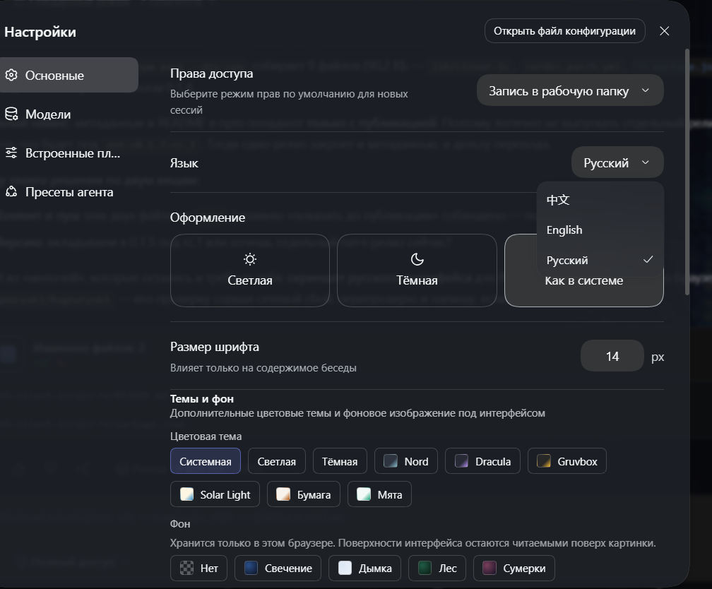
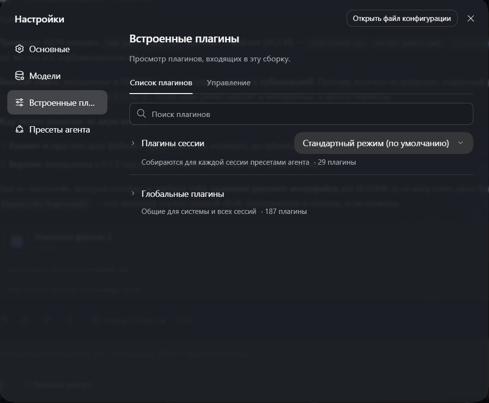

# @ragnoryok1/dsh-client-locale-ru

[](https://www.npmjs.com/package/@ragnoryok1/dsh-client-locale-ru)
[](LICENSE)

**In English.** Russian (`ru`) language pack for the [DeepSeek Harness](https://github.com/deepseek-ai/deepseek-harness) web GUI (`dsh`). It registers `ru` as a selectable client language through the locale service (`ctx.locale.addLanguage`) plus one dictionary per namespace — 53 namespaces, 2,163 strings, built against dsh `0.1.7-rc.1`. Install with `dsh plugin --profile web add @ragnoryok1/dsh-client-locale-ru`, then pick **Русский** in Settings → General. Missing keys fall back to English, so a newer harness keeps working. MIT, community-maintained, not affiliated with DeepSeek. Details below are in Russian.

---

## Как это выглядит

Русский в списке языков и переведённые разделы настроек (снимки сделаны в текущей сборке `0.1.7-alpha.2`):





На втором снимке единица счёта показана в том виде, в каком она была в 0.1.4
(«187 плагины») — в 0.1.5 исправлено на «187 плагинов».

Русская локаль (`ru`) для веб-интерфейса [DeepSeek Harness](https://github.com/deepseek-ai/deepseek-harness) (`dsh`).

Плагин добавляет **русский** как выбираемый язык через контракт языковых пакетов локали: `ctx.locale.addLanguage({ id: 'ru', label: 'Русский', fallback: 'en' })` и по `ru`-словарю на каждый namespace. После выбора **Русский** в Settings → General интерфейс переключается сразу.

## Установка

Это **гибридный плагин** (`dsh.bundle` + `dsh.client`), поэтому он ставится как обычный профиль-бандл через `dsh plugin`:

```sh
dsh plugin --profile web add @ragnoryok1/dsh-client-locale-ru
```

Дальше при следующем старте `dsh web` в настройках появится **Русский**. Отдельно `pnpm add` в собранный `dsh web` не нужен — плагин тянет штатную локаль через сервис `locale`.

## Почему гибрид

`dsh web` берёт клиентские (UI) плагины только из **workspace-пакетов**, а внешний npm-пакет с одним `dsh.client` не подхватывается. Чтобы внешний плагин с UI-частью был устанавливаемым, он должен объявлять **`dsh.bundle`** (профиль-слой), чей `cordis.patch.yml` через `- insert:` добавляет клиентскую строку `locale-ru` в браузерный ростер. Так устроены и другие сторонние плагины (например `@zseven-w/dsh-android`).

## Как это работает

- **Хост-половина** (`lib/index.js`) — пустой `apply()`: языковому плагину не нужна серверная логика, она лишь даёт корректную cordis-строку для Loader.
- **Браузерная половина** (`lib/client.js`) — регистрирует `ru` и словари через сервис `locale` (инжект из `ctx`). Рантайм-импортов фреймворка нет — только сервис.
- **Рантайм-зависимостей нет** — `lib/client.js` не импортирует другие пакеты, поэтому не тянет тяжёлых зависимостей.
- **Эффекты** — язык и словари регистрируются через `ctx.effect(...)`, поэтому выгружаются вместе с плагином (HMR-безопасно).
- **Плюралы** — контракт локали не несёт правил плюрализации (нет ICU/`Intl.PluralRules`); русские формы задаются по ключу.
- **Фолбэк** — отсутствующий русский ключ падает на `en` (настроенный `fallback`).

## Разработка

```sh
pnpm install
pnpm run build     # tsdown -> lib/index.js (node half) + lib/client.js (client bundle)
npm pack           # -> ragnoryok1-dsh-client-locale-ru-<version>.tgz
```

`lib/client.js` собирается в формате, который понимает клиентский загрузчик `dsh` (`__ModuleLoader__.load`), и экспортирует `inject`/`apply`.

## Содержимое

- `src/client/dicts.ts` — русские словари (53 namespace, 2163 ключа, ~2280 строк). Это и есть основная ценность.
- `src/client/index.ts` — точка входа клиентского плагина (регистрация `ru` + словарей).
- `src/index.ts` — пустая host-половина (`apply()`).
- `cordis.patch.yml` — профиль-патч (`- insert:` клиентской строки `locale-ru`).

## Что переведено

Актуальный набор — по тегам харнеса: ключи сняты с профильного коммита, а добавленные
позже падают на `en` при поиске, поэтому пакет не ломает интерфейс на новых версиях.

В 0.1.2 добавлены разделы, которых не было в 0.1.1: `open-in-app` («Открыть в
приложении»), `sidebarFiles`, `sidebarRight` (правый сайдбар с файлами) и
`sidebarCodePreview` (предпросмотр кода). Также обновлены ключи, изменившиеся в
харнесе 0.1.5, и удалены 21 ключ, которых в нём больше нет.

В 0.1.3 пакет догнал харнес 0.1.6-alpha.1: добавлено 139 ключей и 7 новых
разделов — `sidebarTerminal` (терминал в правом сайдбаре), `settings.archivedSessions`
(архивные сессии) и семейство предпросмотра документов (`sidebarDocumentPreview`,
`documentHtml`, `sidebarImage`, `documentMarkdown`, `sidebarPdf`). Кроме этого
переведена экспериментальная «Автопроверка» (`permission.access`: `auto.*`),
подписи и токены палитры команд, поля эндпоинтов в настройках моделей и
изменения в `conversation`, `trajectory`, `chat`, `session-log-download`.
28 ключей, исчезнувших из харнеса, удалены.

Проверка покрытия выполняется по исходникам харнеса: для каждого namespace
сравниваются множества ключей, поэтому следующий выпуск начинается с точного
списка «добавить / проверить / удалить».

В 0.1.5 пакет догнал харнес **0.1.7-rc.1**: добавлено **49 ключей**, 13 обновлены,
16 удалены, namespace `directory-browser` убран (в rc.1 его больше нет). Появились
подписи шагов работы инструментов (`message.stepProcess.prepare.*` и `done.*` —
чтение изображений, запись файлов, подготовка к поиску по коду, веб-поиску,
координации субагентов и другие), просмотр изображений во весь экран
(`image.*`), режимы показа ходов «Стандартный» и «Подробный», установка плагинов
из GitHub с таймаутом и китайским зеркалом, предупреждение о несовместимой версии
плагина, выбор источника загрузки моделей для голосового ввода и сообщения
команды `Cordis`. Уточнены формулировки, где upstream заменил «teammate/agent»
на «subagent», а «Beta» — на «Experimental».

Также в 0.1.5 исправлена единица счёта в инвентаре плагинов: было «187 плагины»,
стало «187 плагинов». Переведены и встроенные снимки интерфейса, добавлены npm
keywords и исправлен peer-диапазон `@deepseek-ai/dsh-client-locale`
(`>=0.1.0-rc.2 <0.2.0`) — раньше `^0.1.0` не разрешался, потому что пакет
публикуется только под prerelease-версиями.

В 0.1.4 пакет догнал харнес **0.1.7-alpha.2** — самый крупный скачок: добавлено
**905 ключей**, 29 изменены, 126 удалены. Новые разделы:

- **`pluginManager`** — встроенная панель плагинов: установка, удаление,
  включение и отключение компонентов, версии, реестры и подсказки по установке;
- **`settings.account`** — учётная запись DeepSeek: вход, баланс, расход,
  API-ключ;
- отдельные разделы настроек, на которые разъехался прежний `settings.plugins`:
  **`settings.agentLoop`**, **`settings.shell`**, **`settings.subagent`**,
  **`settings.webSearch`**;
- **`sidebarBrowser`** — встроенный браузер в правой панели (адрес, песочница,
  восстановление страницы);
- **`sidebarExcel`** и **`sidebarOffice`** — предпросмотр таблиц и документов
  Office; масштабирование (`zoom.*`) добавлено в PDF и изображения;
- **`voice-input`** — экспериментальный голосовой ввод.

Также переведены новые тексты в `conversation` (+194), `chat` (+53),
`workspace` (+43: архив сессий, закрепление), `deliverables` (+31: обзор
изменений хода), `job` (+24: живой вывод фоновых задач), `settings` (+22:
обновление десктопного приложения), `plan`, `open-in-app`, `trajectory`,
`model`, `reference`, `session-log-download` и в руководствах по режимам
агента (`settings.agentPreset`, 12 длинных текстов). Раздел
`settings.archivedSessions` удалён: в 0.1.7 upstream убрал этот пакет, а архив
сессий переехал в `workspace`.

## Лицензия

MIT
