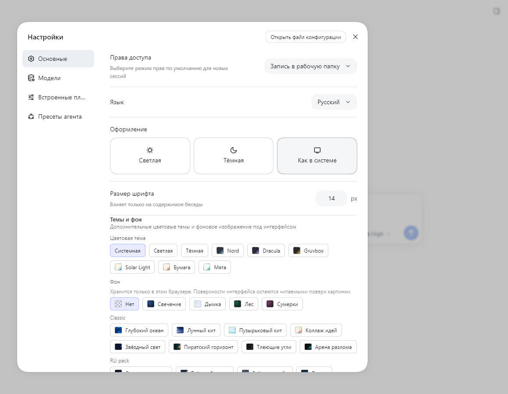
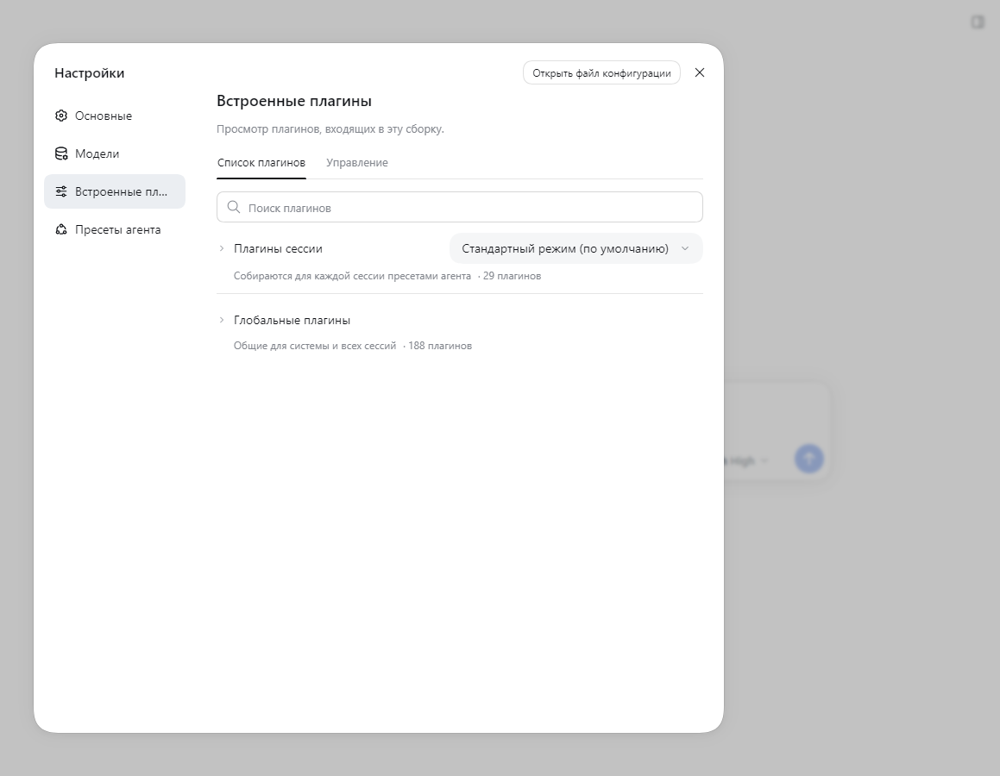

<!-- deepseek-harness-meta
{
  "name": "Russian (ru) language pack for DeepSeek Harness",
  "version": "0.2.0",
  "tags": ["localization", "russian", "i18n", "web-gui", "language-pack"],
  "description": "Full Russian interface for the DeepSeek Harness web GUI: 53 namespaces, 2418 translated strings, Russian screen typography, and a locale audit in CI pinned to a harness tag. Includes the automation-task manager and the reminder catalog.",
  "icon": "https://raw.githubusercontent.com/Ragnoryok1/dsh-client-locale-ru/main/assets/icon.png",
  "compatible_versions": ["v0.2.1-alpha.1", "v0.2.0-rc.2", "v0.2.0-rc.1", "v0.1.7-rc.2", "v0.1.7-rc.1", "v0.1.7-alpha.2"],
  "screenshots": "images",
  "install_method": "dsh plugin --profile web add @ragnoryok1/dsh-client-locale-ru"
}
-->

# @ragnoryok1/dsh-client-locale-ru


[](https://www.npmjs.com/package/@ragnoryok1/dsh-client-locale-ru)
[](LICENSE)
[](https://github.com/Ragnoryok1/dsh-client-locale-ru/actions/workflows/verify.yml)
[](https://github.com/deepseek-ai/deepseek-harness)
[](https://github.com/Ragnoryok1/dsh-client-locale-ru)
[](https://github.com/Ragnoryok1/dsh-client-locale-ru)

**In English.** Russian (`ru`) language pack for the [DeepSeek Harness](https://github.com/deepseek-ai/deepseek-harness) web GUI (`dsh`). It registers `ru` as a selectable client language through the locale service (`ctx.locale.addLanguage`) plus one dictionary per namespace — 52 namespaces, 2,341 strings, built against dsh `0.2.0-rc.2`. Install with `dsh plugin --profile web add @ragnoryok1/dsh-client-locale-ru`, then pick **Русский** in Settings → General. Missing keys fall back to English, so a newer harness keeps working. The scope is the harness's own client interface only — third-party plugin dictionaries are deliberately out of scope, and 11 of the 17 most-downloaded ecosystem plugins ship no strings of their own, so they are already Russian through these namespaces. MIT, community-maintained, not affiliated with DeepSeek. Details below are in Russian.

> **If the pack was useful to you, please star the repository.** It is the only signal that a
> translation is wanted, and it is what decides which parts get worked on next.

---

## Как это выглядит

Русский в списке языков и переведённые разделы настроек (снимки сделаны в сборке `0.1.8`):





Оба снимка обрезаны по левой границе панели: в кадр не попадают названия рабочих
пространств и сессий.

Русская локаль (`ru`) для веб-интерфейса [DeepSeek Harness](https://github.com/deepseek-ai/deepseek-harness) (`dsh`).

Плагин добавляет **русский** как выбираемый язык через контракт языковых пакетов локали: `ctx.locale.addLanguage({ id: 'ru', label: 'Русский', fallback: 'en' })` и по `ru`-словарю на каждый namespace. После выбора **Русский** в Settings → General интерфейс переключается сразу.

> **Если пакет вам пригодился — поставьте звезду.** Это единственный способ показать, что
> перевод нужен, и он реально влияет на то, какие задачи берут в работу. Ни одна кнопка
> «нравится» в интерфейсе не делает этого.
>
> Репозиторий при этом остаётся местом, где видно состояние перевода: [CHANGELOG](CHANGELOG.md)
> с разбором каждого релиза (включая ошибки, которые находили в нём сами), проверки в CI и
> перечень того, что сознательно не переводится.

## Установка

Это **гибридный плагин** (`dsh.bundle` + `dsh.client`), поэтому он ставится как обычный профиль-бандл через `dsh plugin`:

```sh
dsh plugin --profile web add @ragnoryok1/dsh-client-locale-ru
```

Дальше при следующем старте `dsh web` в настройках появится **Русский**. Отдельно `pnpm add` в собранный `dsh web` не нужен — плагин тянет штатную локаль через сервис `locale`.

## Почему гибрид

`dsh web` берёт клиентские (UI) плагины только из **workspace-пакетов**, а внешний npm-пакет с одним `dsh.client` не подхватывается. Чтобы внешний плагин с UI-частью был устанавливаемым, он должен объявлять **`dsh.bundle`** (профиль-слой), чей `cordis.patch.yml` через `- insert:` добавляет клиентскую строку `locale-ru` в браузерный ростер. Так устроены и другие сторонние плагины (например `@zseven-w/dsh-android`).

## Как это работает

- **Хост-половина** (`lib/index.js`) — пустой `apply()`: языковому плагину не нужна серверная логика, она лишь даёт корректную cordis-строку для Loader.
- **Браузерная половина** (`lib/client.js`) — регистрирует `ru` и словари через сервис `locale` (инжект из `ctx`). Рантайм-импортов фреймворка нет — только сервис.
- **Рантайм-зависимостей нет** — `lib/client.js` не импортирует другие пакеты, поэтому не тянет тяжёлых зависимостей.
- **Эффекты** — язык и словари регистрируются через `ctx.effect(...)`, поэтому выгружаются вместе с плагином (HMR-безопасно).
- **Плюралы** — контракт локали не несёт правил плюрализации (нет ICU/`Intl.PluralRules`), и
  компоненты выбирают форму как `count === 1 ? 'ключ.one' : 'ключ.other'`. Русский язык
  требует трёх форм для `n ≥ 2` (2 задачи / 5 задач), поэтому одна строка `.other` не может
  быть верной всегда. Пакет решает это **без** изменения апстрима: `.one` (это ровно `n = 1`)
  содержит естественную форму, а `.other` — конструкцию, корректную при любом `n ≥ 2`
  («Субагентов: 3», «Фоновых задач: 5») или инвариантное сокращение («каждые 2 ч»,
  «ещё 3 стр.»). Ни одна видимая строка не показывает неверную форму числа.
- **Фолбэк** — отсутствующий русский ключ падает на `en` (настроенный `fallback`).

## Типографика

Пакет приводит уже отрисованный русский текст к типографским правилам: «ёлочки» вместо
прямых кавычек, длинное тире вместо дефиса между словами, многоточие вместо трёх точек и
неразрывный пробел между числом и следующим словом или единицей измерения (чтобы «187
плагинов» не разрывалось на две строки). Правила намеренно осторожны: срабатывают только
на однозначных шаблонах, а код, поля ввода, редактируемый текст и элементы с
`data-typography="off"` не трогаются вообще. Повторный проход ничего не меняет.

Правила проверяются скриптом, а не на глаз: `npm run check:typography`.

## Проверки

```sh
npm run build             # сборка трёх выходов
npm run check:typography  # 12 правил типографики, включая «не трогать»
npm run audit -- <дерево харнеса>   # аудит локали
npm run verify -- <дерево харнеса>  # всё вместе
```

Аудит выполняется в CI (`.github/workflows/verify.yml`) против **закреплённого тега**
харнеса, а не против случайного локального чекаута. Гейтом проверяются две вещи, и обе
уже ловили настоящие дефекты:

- **мёртвые namespace** — каждый namespace, который регистрирует пакет, обязан
  существовать в харнессе. В 0.1.6 переводы каталога расписания были зарегистрированы
  под именем `schedule.manager`, тогда как читает их `schedule.catalog`: проверка покрытия
  по ключам при этом рапортовала «всё переведено»;
- **пары форм числа** — множества `.one`/`.other` должны совпадать, потому что клиент
  выбирает форму как `count === 1 ? '.one' : '.other'`.

Число покрытия выводится, но не является гейтом: точный список «добавить / удалить»
требует сравнения ключей **по namespace** (это делает релизная оснастка), а сравнение имён
ключей глобально отметило бы разделы, которые пакет сознательно оставляет на английском.

## Область покрытия: только официальный интерфейс

Пакет переводит **собственные namespace клиента харнесса** — 53 namespace, сверенные с
закреплённым тегом. Словари сторонних плагинов в область сознательно не входят, и вот
почему.

Мы проверили 17 самых скачиваемых плагинов экосистемы (npm, `keywords:dsh-plugin`,
скачивания за месяц) и посмотрели, какие из них вообще поставляют собственные строки:

| Что обнаружено | Плагинов |
|---|---|
| **Своих строк нет** — интерфейс берёт текст из namespace харнеса | **11 из 17** |
| Крупный собственный словарь (подтверждено вручную) | 2 — `dshmarket` (~1262 ключа), `@nanmicoder/dsh-agent-teams` (420) |
| Только типы `.d.ts`, строк нет | 1 — `dsh-plugin-model-proxy` |
| Требует отдельной проверки | 3 |

Практическое следствие: у **11 из 17** популярнейших плагинов русский интерфейс уже
работает — их текст лежит в общих namespace харнеса, которые пакет переводит полностью.
Отдельный словарь нужен только там, где плагин везёт свои строки, а такой словарь — это
обязательство следить за чужими релизами: у `dshmarket` уже версия 1.66.3, и её ключи
меняются независимо от харнеса.

Поэтому здесь один пакет и одно обязательство: **официальный интерфейс, переведённый и
проверенный**, без гонки за чужими словарями. Нужен конкретный плагин — заведите issue:
словарь для него возможен как отдельный слой, привязанный к версии, а не как молчаливое
обещание «покрыто всё».

## Разработка

```sh
pnpm install
pnpm run build     # tsdown -> lib/index.js (node half) + lib/client.js (client bundle)
npm pack           # -> ragnoryok1-dsh-client-locale-ru-<version>.tgz
```

`lib/client.js` собирается в формате, который понимает клиентский загрузчик `dsh` (`__ModuleLoader__.load`), и экспортирует `inject`/`apply`.

## Содержимое

- `src/client/dicts.ts` — русские словари (53 namespace, 2418 перевод, ~2900 строк). Это и есть основная ценность.
- `src/client/index.ts` — точка входа клиентского плагина (регистрация `ru` + словарей).
- `src/index.ts` — пустая host-половина (`apply()`).
- `cordis.patch.yml` — профиль-патч (`- insert:` клиентской строки `locale-ru`).

## Что переведено

Актуальный набор — по тегам харнеса: ключи сняты с профильного коммита, а добавленные
позже падают на `en` при поиске, поэтому пакет не ломает интерфейс на новых версиях.

### 0.1.7 — исправлен мёртвый namespace, переведён менеджер задач, переписаны числительные

Главное в релизе — **исправление ошибки из 0.1.6**. Тогда было записано, что namespace
`schedule.catalog` упразднён, а его место занял `schedule.manager`. На деле в харнесе
**оба** namespace живут и по отдельности: `schedule.catalog` — это каталог напоминаний в
шапке сессии с частотами и единицами, `schedule.manager` — новый менеджер задач
автоматизации. Из-за неверного вывода ~30 строк переводов (напоминания, частота, единицы
времени) были зарегистрированы под именем, которое никто не читает, и **никогда не
показывались** в интерфейсе. Теперь каталог зарегистрирован как `schedule.catalog`.

- **исправлено:** переводы каталога расписания снова видны — `trigger.*`, `list.*`,
  `delete.*`, `frequency.*`, `cron.*`, `unit.*`, `relative.*`, `mark.aria`, `hover.more`;
- **добавлен `schedule.manager`** (188 ключей) — менеджер задач автоматизации целиком на
  русском: панель и каталог задач, поиск, фильтр состояний, сведения о задаче и её вкладки,
  **журнал запусков** с правилами хранения, редактор расписания (дата, время, час, минута,
  секунда, часовой пояс, интервал повтора), правила повтора (разово, каждые N минут/часов/
  секунд, ежедневно, пн–пт, еженедельно, свой cron), cron-форма с выбором дат и минуты,
  удаление с подтверждением, уведомления и карточки;
- **числительные переписаны** (17 пар ключей): формы, которые ломались на числах 2–4,
  заменены на корректные при любом `n ≥ 2` — например «2 субагентов» → «Субагентов: 2»,
  «каждые 2 часов» → «каждые 2 ч». Ещё 8 строк с `{count}` перед склоняемым словом
  переведены на сокращения: «ещё 3 строк» → «ещё 3 стр.»;
- **добавлено 7 ключей**, которые отсутствовали: `blocked.composer`,
  `defaultWorkspace.title`, `schedule.active`, `settings.transcript.expanded`,
  `status.scheduled`, `status.overdue` и namespace `shortcuts.layout` (подпись команды
  показа левой панели);
- **новая проверка в проекте:** аудит имён namespace. Прежняя проверка покрытия
  сверяла ключи внутри namespace, но не сверяла сами имена, поэтому целый namespace
  мог быть зарегистрирован под несуществующим именем и тихо не работать. Теперь имена
  извлекаются из всех способов их объявления (`const NS`/`SETTINGS_NS`/`namespace`,
  `locale.register`, `locale.bind`, `PropsLocale<…>`) и сравниваются множествами.

В 0.1.2 добавлены разделы, которых не было в 0.1.1: `open-in-app` («Открыть в
приложении»), `sidebarFiles`, `sidebarRight` (правый сайдбар с файлами) и
`sidebarCodePreview` (предпросмотр кода). Также обновлены ключи, изменившиеся в
харнесе 0.1.5, и удалены 21 ключ, которых в нём больше нет.

В 0.1.3 пакет догнал харнес 0.1.6-alpha.1: добавлено 139 ключей и 7 новых
разделов — `sidebarTerminal` (терминал в правом сайдбаре), `settings.archivedSessions`
(архивные сессии) и семейство предпросмотра документов (`sidebarDocumentPreview`,
`documentHtml`, `sidebarImage`, `documentMarkdown`, `sidebarPdf`). Кроме этого
переведена экспериментальная «Автопроверка» (`permission.access`: `auto.*`),
подписи и токены палитры команд, поля эндпоинтов в настройках моделей и
изменения в `conversation`, `trajectory`, `chat`, `session-log-download`.
28 ключей, исчезнувших из харнеса, удалены.

Проверка покрытия выполняется по исходникам харнеса: для каждого namespace
сравниваются множества ключей, поэтому следующий выпуск начинается с точного
списка «добавить / проверить / удалить».

В 0.1.6 пакет догнал харнес **0.1.7-rc.2**: добавлено **252 ключа**, 18 обновлены,
26 удалены, добавлены два новых namespace. Изменения:

- **`shortcuts`** (новый namespace, 56 ключей) — редактор горячих клавиш: запись
  сочетания, конфликты, зарезервированные комбинации, подсказки для macOS и
  Windows, восстановление значений по умолчанию;
- **`schedule.manager`** (70 ключей на тот момент) — менеджер задач автоматизации: список,
  удаление, повтор, история запусков, выражения Cron. **Ошибочно было записано, что
  namespace `schedule.catalog` при этом упразднён; в 0.1.7 это исправлено — оба
  namespace существуют параллельно**;
- **`settings.account`** (50 ключей) — первый запуск приложения: приветствие,
  выбор назначения и глубины показа хода работы, пополнение баланса, выход из
  учётной записи во время выполнения задач;
- добавлены подписи добавления и удаления инструментов на ходу
  (`message.tools*`, `trajectory.layout.*`), команды правой боковой панели
  (`sidebarRight`), состояния «сначала выберите сессию» в панелях, обновлено
  название раздела настроек: «Инструменты для кода» вместо «Инструментов
  разработчика»;
- 18 ключей обновлены под изменившийся английский текст, 26 удалены. Единый термин
  «рабочая папка» вместо «рабочей области» в одном месте.

В 0.1.5 пакет догнал харнес **0.1.7-rc.1**: добавлено **49 ключей**, 13 обновлены,
16 удалены, namespace `directory-browser` убран (в rc.1 его больше нет). Появились
подписи шагов работы инструментов (`message.stepProcess.prepare.*` и `done.*` —
чтение изображений, запись файлов, подготовка к поиску по коду, веб-поиску,
координации субагентов и другие), просмотр изображений во весь экран
(`image.*`), режимы показа ходов «Стандартный» и «Подробный», установка плагинов
из GitHub с таймаутом и китайским зеркалом, предупреждение о несовместимой версии
плагина, выбор источника загрузки моделей для голосового ввода и сообщения
команды `Cordis`. Уточнены формулировки, где upstream заменил «teammate/agent»
на «subagent», а «Beta» — на «Experimental».

Также в 0.1.5 исправлена единица счёта в инвентаре плагинов: было «187 плагины»,
стало «187 плагинов». Переведены и встроенные снимки интерфейса, добавлены npm
keywords и исправлен peer-диапазон `@deepseek-ai/dsh-client-locale`
(`>=0.1.0-rc.2 <0.2.0`) — раньше `^0.1.0` не разрешался, потому что пакет
публикуется только под prerelease-версиями.

В 0.1.4 пакет догнал харнес **0.1.7-alpha.2** — самый крупный скачок: добавлено
**905 ключей**, 29 изменены, 126 удалены. Новые разделы:

- **`pluginManager`** — встроенная панель плагинов: установка, удаление,
  включение и отключение компонентов, версии, реестры и подсказки по установке;
- **`settings.account`** — учётная запись DeepSeek: вход, баланс, расход,
  API-ключ;
- отдельные разделы настроек, на которые разъехался прежний `settings.plugins`:
  **`settings.agentLoop`**, **`settings.shell`**, **`settings.subagent`**,
  **`settings.webSearch`**;
- **`sidebarBrowser`** — встроенный браузер в правой панели (адрес, песочница,
  восстановление страницы);
- **`sidebarExcel`** и **`sidebarOffice`** — предпросмотр таблиц и документов
  Office; масштабирование (`zoom.*`) добавлено в PDF и изображения;
- **`voice-input`** — экспериментальный голосовой ввод.

Также переведены новые тексты в `conversation` (+194), `chat` (+53),
`workspace` (+43: архив сессий, закрепление), `deliverables` (+31: обзор
изменений хода), `job` (+24: живой вывод фоновых задач), `settings` (+22:
обновление десктопного приложения), `plan`, `open-in-app`, `trajectory`,
`model`, `reference`, `session-log-download` и в руководствах по режимам
агента (`settings.agentPreset`, 12 длинных текстов). Раздел
`settings.archivedSessions` удалён: в 0.1.7 upstream убрал этот пакет, а архив
сессий переехал в `workspace`.

## Лицензия

MIT

## История изменений

[CHANGELOG.md](CHANGELOG.md) — что было в каждом выпуске.
